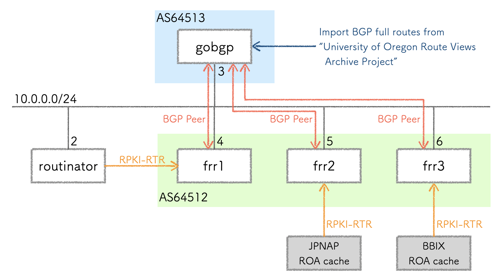

# Try ROV with "FRRouting + GoBGP + Routinator + ROA public cache" on Docker
このリポジトリは、Dockerコンテナとして[FRRouting](https://frrouting.org/)・[GoBGP](https://github.com/osrg/gobgp)・[Routinator](https://www.nlnetlabs.nl/projects/rpki/routinator/)を起動し、BGPのフルルートをインポートし、ROV(Route origin validation)の挙動などを確認するツールです。


## 構成
このツールは、以下のコンポーネントにより構成しています。

- GoBGP
  - Goで書かれたオープンソースのBGP実装
  - GitHubのmasterブランチよりビルド
  - [Route Views Archive Project Page](https://routeviews.org/)にて公開されているフルルートのRIBをインポートし、BGPにてFRRoutingに対してフルルートを広告
- Routinator
  - Rustで書かれたオープンソースのRPKI Relying Partyソフトウェア
  - 公式Dockerイメージのv0.12.1を使用
  - ROAの取得、BGPルータとのRPKI-RTRにも対応
- FRRouting
  - Quaggaから派生したオープンソースのルーティングプロトコルスイート
  - 公式Dockerイメージの9.0.0を使用
  - Routinator、[JPNAP ROAキャッシュ](https://www.mfeed.ad.jp/rpki/tech.html)、[BBIX ROAキャッシュ](https://www.bbix.net/rpki/tech/)から、RPKI-RTRにてVRP(Validate ROA Payload)を受信
  - GoBGPからフルルートを受信し、ROV(Route origin validation)を実施



## 実行方法
### MRT format RIBのダウンロード
- [Route Views Archive Project](https://routeviews.org/)から **MRT format RIB** をダウンロード
  - [/bgpdata/2023.08/RIBS](https://routeviews.org/bgpdata/2023.08/RIBS/)の[rib.20230830.0000.bz2](https://routeviews.org/bgpdata/2023.08/RIBS/rib.20230830.0000.bz2)など
- ダウンロードした **rib.yyyymmdd.hhmm.bz2** ファイルを展開
- 展開した **rib.yyyymmdd.hhmm**  を、 **gobgp/ribs/** 配下に移動

### Docker Compose起動
```
docker compose up -d
```
実行例
```
% docker compose up -d
[+] Running 16/16
 ✔ routinator 5 layers [⣿⣿⣿⣿⣿]      0B/0B      Pulled                                             6.0s
   ✔ 6875df1f5354 Already exists                                                                  0.0s
   ✔ 160d0347c010 Already exists                                                                  0.0s
   ✔ 6eed1cee6d09 Already exists                                                                  0.0s
   ✔ 9d6980578a97 Already exists                                                                  0.0s
   ✔ 14c5217b1cfb Already exists                                                                  0.0s
 ✔ frr2 Pulled                                                                                   10.3s
 ✔ frr3 Pulled                                                                                   10.3s
 ✔ frr1 7 layers [⣿⣿⣿⣿⣿⣿⣿]      0B/0B      Pulled                                                10.3s
   ✔ 8c6d1654570f Already exists                                                                  0.0s
   ✔ 7d0afa75b38d Pull complete                                                                   1.0s
   ✔ b53793227860 Pull complete                                                                   2.0s
   ✔ 0ac198d11877 Pull complete                                                                   4.5s
   ✔ 4f4fb700ef54 Pull complete                                                                   4.5s
   ✔ 83f241f7a471 Pull complete                                                                   4.5s
   ✔ ecb4523afdab Pull complete                                                                   4.5s
[+] Building 1.0s (9/9) FINISHED
 => [gobgp internal] load build definition from Dockerfile                                        0.0s
 => => transferring dockerfile: 617B                                                              0.0s
 => [gobgp internal] load .dockerignore                                                           0.0s
 => => transferring context: 2B                                                                   0.0s
 => [gobgp internal] load metadata for docker.io/library/golang:1.20.6-alpine3.18                 0.9s
 => [gobgp builder 1/2] FROM docker.io/library/golang:1.20.6-alpine3.18@sha256:7839c9f01b5502d7c  0.0s
 => CACHED [gobgp builder 2/2] RUN apk update && apk add git   && git clone https://github.com/o  0.0s
 => CACHED [gobgp stage-1 1/3] COPY --from=builder /go/src/github.com/osrg/gobgp/cmd/gobgp/gobgp  0.0s
 => CACHED [gobgp stage-1 2/3] COPY --from=builder /go/src/github.com/osrg/gobgp/cmd/gobgpd/gobg  0.0s
 => CACHED [gobgp stage-1 3/3] COPY --from=builder /ribs /ribs                                    0.0s
 => [gobgp] exporting to image                                                                    0.0s
 => => exporting layers                                                                           0.0s
 => => writing image sha256:ddab0141cc075ce7da75dedbb7374e1f4ff08fe9ce49a2c57ebe929b99b9b52c      0.0s
 => => naming to docker.io/library/try_rov_frrouting_gobgp_routinator_on_docker-gobgp             0.0s
[+] Running 6/6
 ✔ Network try_rov_frrouting_gobgp_routinator_on_docker_network-bgp     Created                   0.0s
 ✔ Container try_rov_frrouting_gobgp_routinator_on_docker-gobgp-1       Started                   0.8s
 ✔ Container try_rov_frrouting_gobgp_routinator_on_docker-frr1-1        Started                   0.7s
 ✔ Container try_rov_frrouting_gobgp_routinator_on_docker-frr3-1        Started                   0.7s
 ✔ Container try_rov_frrouting_gobgp_routinator_on_docker-frr2-1        Started                   0.8s
 ✔ Container try_rov_frrouting_gobgp_routinator_on_docker-routinator-1  Started                   0.9s
 %
 ```

### GoBGPにフルルートのインポート
```
docker compose exec gobgp /gobgp mrt inject --only-best global /ribs/rib.yyyymmdd.hhmm
```
実行例
```
% docker compose exec gobgp /gobgp mrt inject --only-best global /ribs/rib.20230830.0000
%
```

## 操作方法
### GoBGPのBGPネイバー状態の確認
```
docker compose exec gobgp /gobgp neighbor
```
実行例
```
% docker compose exec gobgp /gobgp neighbor
Peer        AS  Up/Down State       |#Received  Accepted
10.0.0.4 64512 00:00:59 Establ      |        0         0
10.0.0.5 64512 00:00:59 Establ      |        0         0
10.0.0.6 64512 00:00:59 Establ      |        0         0
```

### FRRoutingへのログイン
```
docker compose exec <ホスト名> vtysh
```
実行例
```
% docker compose exec frr1 vtysh
% Can't open configuration file /etc/frr/vtysh.conf due to 'No such file or directory'.
Configuration file[/etc/frr/frr.conf] processing failure: 11

Hello, this is FRRouting (version 9.0_git).
Copyright 1996-2005 Kunihiro Ishiguro, et al.

frr1#
```

### FRRoutingのBGPネイバー状態の確認
```
show bgp summary
```
実行例
```
frr1# show bgp summary

IPv4 Unicast Summary (VRF default):
BGP router identifier 10.0.0.4, local AS number 64512 vrf-id 0
BGP table version 0
RIB entries 1796247, using 329 MiB of memory
Peers 1, using 13 KiB of memory

Neighbor        V         AS   MsgRcvd   MsgSent   TblVer  InQ OutQ  Up/Down State/PfxRcd   PfxSnt Desc
10.0.0.3        4      64513    986261        32        0    0    0 00:15:14       986216        0 N/A

Total number of neighbors 1
```

### ROAキャッシュサーバの設定確認
```
show rpki cache-server
```
実行例
```
frr1# show rpki cache-server
host: 10.0.0.2 port: 3323, preference: 1
```

### ROAキャッシュサーバへの接続状況
```
show rpki cache-connection
```
実行例
```
frr1# show rpki cache-connection
Connected to group 1
rpki tcp cache 10.0.0.2 3323 pref 1 (connected)
```

### VRP(Validate ROA Payload)の確認
```
show rpki prefix-table
```
実行例
```
frr1# show rpki prefix-table
RPKI/RTR prefix table
Prefix                                   Prefix Length  Origin-AS
1.128.0.0                                   11 -  11   1221
1.0.0.0                                     24 -  24   13335

  <中略>

2a01:c000::                                 19 -  48   5511
2003::                                      19 -  19   3320
Number of IPv4 Prefixes: 377013
Number of IPv6 Prefixes: 82276
```

### 特定prefixのROAの確認
```
show rpki prefix <prefix/mask>
```
実行例
```
frr1# show rpki prefix 1.1.1.0/24
Prefix                                   Prefix Length  Origin-AS
1.1.1.0                                     24 -  24   13335
```

### ROVでvalidとなった経路の確認
```
show bgp ipv4 unicast rpki valid
```
実行例
```
frr1# show bgp ipv4 unicast rpki valid
BGP table version is 0, local router ID is 10.0.0.4, vrf id 0
Default local pref 100, local AS 64512
Status codes:  s suppressed, d damped, h history, * valid, > best, = multipath,
               i internal, r RIB-failure, S Stale, R Removed
Nexthop codes: @NNN nexthop's vrf id, < announce-nh-self
Origin codes:  i - IGP, e - EGP, ? - incomplete
RPKI validation codes: V valid, I invalid, N Not found

    Network          Next Hop            Metric LocPrf Weight Path
V   1.0.0.0/24       203.189.128.233               200      0 64513 23673 13335 i
V   1.0.4.0/22       203.189.128.233               200      0 64513 23673 6939 7545 2764 38803 i

  <中略>

V   223.233.36.0/22  203.189.128.233               200      0 64513 23673 9498 45609 ?
V   223.233.40.0/22  203.189.128.233               200      0 64513 23673 9498 45609 ?

Displayed  449355 routes and 986216 total paths
```
### ROVでnot foundとなった経路の確認
```
show bgp ipv4 unicast rpki notfound
```
実行例
```
frr1# show bgp ipv4 unicast rpki notfound
BGP table version is 0, local router ID is 10.0.0.4, vrf id 0
Default local pref 100, local AS 64512
Status codes:  s suppressed, d damped, h history, * valid, > best, = multipath,
               i internal, r RIB-failure, S Stale, R Removed
Nexthop codes: @NNN nexthop's vrf id, < announce-nh-self
Origin codes:  i - IGP, e - EGP, ? - incomplete
RPKI validation codes: V valid, I invalid, N Not found

    Network          Next Hop            Metric LocPrf Weight Path
N   0.0.0.0/0        94.156.252.18            0    100      0 64513 34224 3356 i
V   1.0.0.0/24       203.189.128.233               200      0 64513 23673 13335 i

  <中略>

V   223.233.36.0/22  203.189.128.233               200      0 64513 23673 9498 45609 ?
V   223.233.40.0/22  203.189.128.233               200      0 64513 23673 9498 45609 ?

Displayed  986216 routes and 986216 total paths
```

### ROVでinvalidとなった経路の確認
```
show bgp ipv4 unicast rpki invalid
```

実行例
```
frr1# show bgp ipv4 unicast rpki invalid
BGP table version is 0, local router ID is 10.0.0.4, vrf id 0
Default local pref 100, local AS 64512
Status codes:  s suppressed, d damped, h history, * valid, > best, = multipath,
               i internal, r RIB-failure, S Stale, R Removed
Nexthop codes: @NNN nexthop's vrf id, < announce-nh-self
Origin codes:  i - IGP, e - EGP, ? - incomplete
RPKI validation codes: V valid, I invalid, N Not found

    Network          Next Hop            Metric LocPrf Weight Path
I   1.6.219.0/24     203.189.128.233                10      0 64513 23673 23764 6453 4755 9583 137130 i
I   1.6.230.0/24     203.189.128.233                10      0 64513 23673 23764 6453 4755 i

  <中略>

I   223.123.103.0/24 203.189.128.233                10      0 64513 23673 17557 138423 i
I   223.224.38.0/24  203.189.128.233                10      0 64513 23673 9498 i

Displayed  5482 routes and 986216 total paths
```
## Docker Compose停止
```
docker compose down
```
実行例
```
% docker compose down
[+] Running 6/6
 ✔ Container try_rov_frrouting_gobgp_routinator_on_docker-frr3-1        Removed                   1.1s
 ✔ Container try_rov_frrouting_gobgp_routinator_on_docker-routinator-1  Removed                   3.6s
 ✔ Container try_rov_frrouting_gobgp_routinator_on_docker-frr2-1        Removed                   1.1s
 ✔ Container try_rov_frrouting_gobgp_routinator_on_docker-gobgp-1       Removed                   1.1s
 ✔ Container try_rov_frrouting_gobgp_routinator_on_docker-frr1-1        Removed                   1.1s
 ✔ Network try_rov_frrouting_gobgp_routinator_on_docker_network-bgp     Removed                   0.0s
%
```
